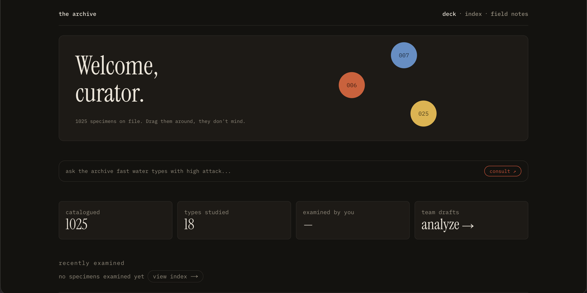

# archive-dex

A Pokédex reimagined as a natural history archive — 1,025 specimens, plain-language search, AI-generated curator notes grounded in real data, and an AI agent that analyzes team weaknesses by reasoning over live type data.

**[Live site →](https://archive-dex.vercel.app)**



---

## What it demonstrates

- **Three distinct AI integration patterns** — structured output, streaming with grounding, and multi-step tool calling.
- **Performance engineering at scale** — scaling to 1,025 specimens, with fixes chosen by measurement.
- **Type-safe, resilient architecture** — single-source types shared across runtime and compile-time, with fetch handling proportional to data criticality.

---

## AI architecture

Three patterns, each chosen to fit a specific problem rather than defaulting to a chatbot.

**1. Structured output — natural-language search.** "Fast water types" becomes a validated filter object, not a conversation. A Zod schema defines the exact shape the model must return; the validated result feeds the existing URL-based filter system. The AI acts as a *parser*, which makes it reliable, testable, and reusable on infrastructure already built for manual filtering.

**2. Streaming + grounding — curator notes.** Each specimen page streams a short curator's note, token by token. The model receives the specimen's real stats and is instructed to interpret only those numbers — no invented data, no recalled lore. Grounding (real data in the prompt) and formatting (plain prose, enforced by prompt constraints) are handled as separate problems; both are required.

**3. Tool calling — team weakness analyzer.** Given a team, the model calls a type-lookup tool once per member, then reasons over the results to find shared weaknesses. The tool call is *necessary*, not decorative — a specific team's overlapping weaknesses can't come from training data; they must be looked up and computed. Multi-step execution via `stopWhen: stepCountIs()`.

**Model selection by task:** Haiku for search and curator notes (simple extraction and short generation), Sonnet for team analysis (multi-step reasoning, where the quality gain was measurable). Matching model to task difficulty rather than defaulting to the most capable one.

---

## Engineering decisions

**N+1 fetching at build time, by choice.** The grid fetches ~1,026 requests (a list, then each detail in parallel). Accepted intentionally: the data is immutable, cached indefinitely (`revalidate: false`), and runs once at build into static HTML. Production serves instant pre-rendered pages; the cost is paid once, not per request.

**Performance: measured, not assumed.** Scaling to 1,025 cards introduced scroll lag. Virtualization would have fixed it — but it unmounts off-screen elements, breaking the filter and transition animations. Instead: `content-visibility: auto` for native render-skipping (animations intact), plus search and pagination capping the rendered set at 50. Search solved both the performance cost and the navigability of a 1,025-item wall. Virtualization was deliberately *not* used; the scroll was already smooth and the library's costs outweighed its benefits.

**Resilient fetching, proportional to criticality.** The bulk grid uses `Promise.allSettled` (one failed specimen doesn't break the grid). A missing specimen triggers `notFound()` (it *is* the page). A missing species description degrades to empty (optional enrichment shouldn't break the page).

**Single sources of truth.** The 18 types are a `const` array; both the TypeScript union and Zod schemas derive from it (`as const` + `z.enum`). The stat shape is a Zod schema with its type derived via `z.infer`. Runtime validation and compile-time types can't drift. The type-color map is `Record<PokemonType, string>` — adding a type is a compile error until its color exists.

**Server/client boundaries.** Pages and data fetching are server components; only interactive pieces (AI bars, draggable elements, localStorage readers) are client. Client-only data on server-rendered pages uses a mount-gate pattern to avoid hydration mismatches.

---

## Design

A museum/field-specimen archive, not a game UI: near-black background, parchment text, a single vermilion accent, with muted type colors as the only other color. Instrument Serif for specimen names, IBM Plex Mono for data labels, Archivo for body. Ghosted oversized dex numbers, cross-page sprite morphing via the View Transitions API, and motion that respects `prefers-reduced-motion` throughout.

---

## Stack

Next.js (App Router) · TypeScript · Tailwind CSS v4 · Vercel AI SDK · Motion · Vercel. Data from [PokéAPI](https://pokeapi.co).

---

## Running locally

```bash
git clone https://github.com/dev-rome/Archive-Dex.git
cd Archive-Dex && npm install
echo "ANTHROPIC_API_KEY=sk-ant-..." > .env.local
npm run dev
```

AI features require the API key; the rest runs without it.

---

Built by [Jerome Haynes](https://www.linkedin.com/in/jerome-haynes/) · [GitHub](https://github.com/dev-rome)